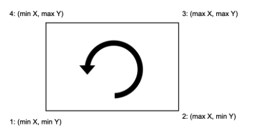

# Introduction 

In this activity you will write a simple procedural program using Java.  The goal of this activity is to help you review Java’s basic syntax for constructs you should already know like read from the keyboard, write to the screen, use variables, write conditionals, and perform loops.  Use the Java Guide to help you work with the Java syntax.  

# Setup 

Create a new project for this activity.  Download the base code and input test files from the course's GitHub repository. You should have one source code named BSheep.java and five text files.  

# BSheep - Build the Fence

This activity was adapted from a problem available at [SPOJ](https://www.spoj.com/) (Sphere Online Judge) website.  

At the beginning of Spring all the sheep move to the higher pastures in the mountains.  If there are thousands of them, it is well worthwhile gathering them together in one place.  But sheep don't like to leave their grasslands.  Help the shepherd and build him a rectangular fence which would surround all the sheep.  The fence should be rectangular and should have the smallest possible length!  Assume that sheep are negligibly small and that they are not moving.  Sometimes a few sheep are standing in the same place.  If there is only one sheep, it is probably dying, so no fence is needed at all. 

The number of sheep and their locations are obtained from the user.  The first number entered defines the number of sheep and the next inputs have the x and y coordinates of each sheep, one per line.  For example, the following input sequence describes the locations of 5 sheep at coordinates (0,0), (0,5), (10,5), (3,3), and (10,0).   

```
5 
0 0 
0 5 
10 5 
3 3 
10 0 
```

The program’s goal is to display the four corner coordinates of the smallest possible length rectangular fence starting at the bottommost and as far to the left as possible. The other coordinates should be written in anticlockwise order.   



For the given example the output should be:  

```
Fence coordinates: {(0,0), (10,0), (10,5), (0,5)} 
```
 
If the program is given an invalid number of sheep it should print:  

```
Invalid input! We need at least 2 sheep to build a fence! 
```

# Challenge 

Instead of having the user type in the inputs, modify your code so it reads the number of sheep and their coordinates from a test file.  Use the provided text files to test your code.  