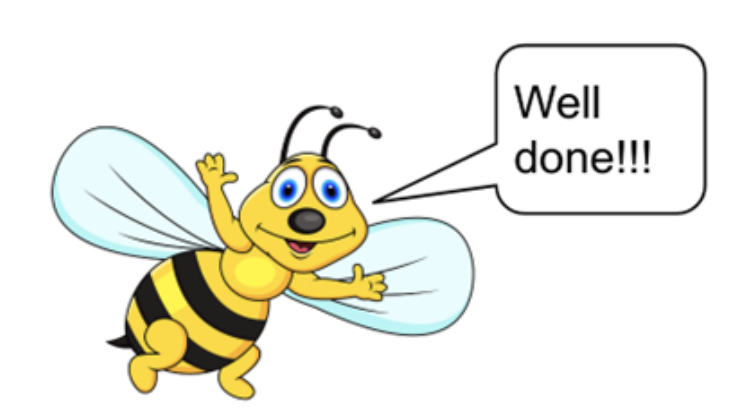

# Introduction 

In this activity you will work in pairs. One of you will be responsible for implementing the Bee class, while the other will write the code for the BeeDriver class.  

# Bee Class

* a Bee has a type, which can be 0 (for workers), 1 (for drone), and 2 (for queen); 
* define class constants for the type of bees; 
* a Bee always belongs to a beehive identified by a name; 
* a Bee has a location defined by two integers x and y; 
* there should be two ways to create a Bee object: one that takes a beehive name and another one that takes a beehive name and a type; 
* if the type of a bee is not specified (or invalid), assume that the bee is a worker bee; 
* bees are always created at location (0, 0), which means that they are created inside the beehive; 
* define getter methods for your Bee class;  
* create a private helper method called getTypeAsString that returns the type of the bee as a String; use this method in toString; 
* define a move method that accepts new coordinates for the bee; 
* define a isInsideHive method that returns true/false depending on whether the bee is inside the hive (x = 0 and y = 0) or outside, respectively; 
* override the toString method returning an appropriate String from the object; see example output below for * two bees from the “Crazy for Nectar” beehive (as you can see, if the bee is inside the beehive its coordinates should not be displayed):   

```
worker from "Crazy for Nectar" is outside the hive @ (150, 200) 
drone from "Crazy for Nectar" is inside the hive! 
```

# BeeDriver Class 

Note that you are NOT supposed to implement the Bee class! Just ignore the errors you will get saying that the Bee class is not defined. You can take a look at the Bee class definition to figure it out the interface you should expect (i.e., which method should be available for you to use). If in doubt, ask your teammate for clarification.  

In main, write a program that defines an array of 15 Bee’s. All of the bees should be members of the same beehive (use your imagination to define a cool name for you beehive).  The first bee (i.e., index = 0) should be the queen. The remaining bees should be randomly assigned, but approximately 10% should be drones and around 90% of workers.   

Next, move all bees to random locations in the square defined by the left upper corner [-10, 10] and the right bottom corner [10, -10]. Right after you moved each bee, print information about it using the toString method implicit call.  

When you are done, ask your partner to share their Bee class code so you can incorporate it in your program.  The four of you should work together now to have the BeeDriver application working properly.   

