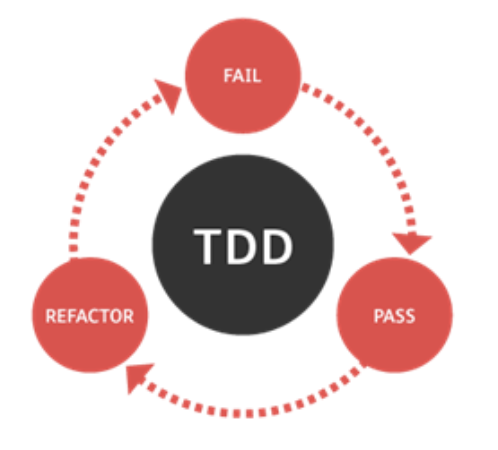

# Introduction

In this activity you will implement a Fraction class, according to the specifications detailed in the next section.  There is a set of test cases that your class should pass.  All tests are defined in the class named FractionTest.  As we discussed in class, TDD (or Test-Driven Development) encourages the development team to write all tests for a class before its actual implementation.  Advocates of TDD believe that this approach leads to a more focused coding because it gives a specific goal to the developer, which is to PASS all tests. However, in order for TDD to be effective, the tests must be thorough. In other words, a good set of tests is one that captures and verifies all possible uses of your class.  

# Specifications

The Fraction class is defined by two integers: the  numerator and the denominator.  The class has a parameterless constructor that sets both the numerator and denominator to one. The Fraction class also defines two parameterized constructors: one that accepts a value for the numerator, setting the denominator to one, and another one that allows the user to set both the numerator and denominator (however, if the informed denominator is zero, this constructor should set it to one instead). The Fraction class also defines “getter” and “setter” methods. The setDenominator method should forbid the user from changing the Fraction’s denominator to zero. 

The Fraction class should implement the following methods: 

* getValue returns the value of the fraction (as a floating-point value); in other words, this method returns the results of dividing its numerator by its denominator; 
* isNegative returns true if the value of the fraction is less than zero; false otherwise; 
* gcd is a helper method that returns the “Greatest Common Divisor” of the numerator and the denominator of the fraction object; 
* simplify divides the fraction’s numerator and denominator by the gcd of the numbers; also, if the numerator is positive and the denominator is negative, this method switch signs between them; finally, if the numerator and the denominator are both negatives, this method cancels their signs, making them both positive; 
* isProper returns true if the function is proper; false otherwise; a fraction is considered proper if the absolute value of its numerator is smaller than the absolute value of its denominator.  

All of the concepts related to fractions discussed in this section should be familiar to you.  But if you are in doubt, don’t be shy about asking your instructor or LA for a quick review.  

# TDD

Open the Fraction class.  As you can see, a skeleton code for the class is given to you.  Run FractionTest and verify that your class is failing all tests.  Begin the implementation of the Fraction class.  Once you are satisfied with one method (or constructor), run the tests again and verify if you made any progress, measured by the number of tests that your code is now passing. You are only done when your class passes all tests.  