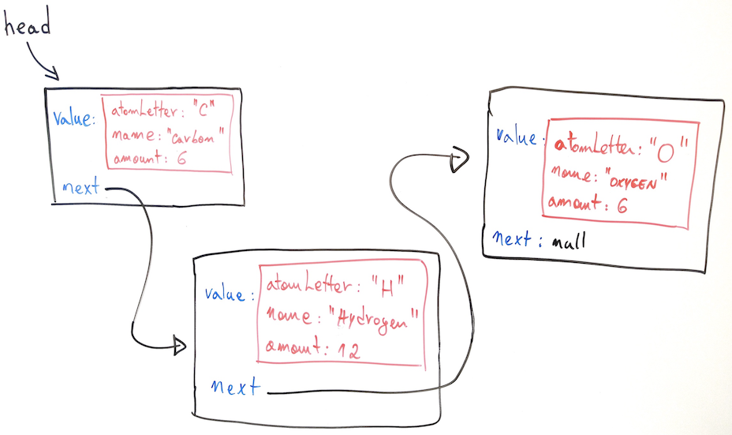

# Introduction

In this programming assignment you will extend the (generic) linked list implementation discussed in class to create a suitable data structure to represent [molecules](https://en.wikipedia.org/wiki/Molecule). Remember from chemistry that molecules are formed when two or more atoms build chemical bonds with each other. In our representation of molecules, they are made of nodes of elements chained together.  

# The Element Class

A chemical element is a pure substance that consists of one type of atom and it is represented in this project by the Element class. Users can create an element by informing its atom letter, name, and amount (the last 2 have default values). Atom letters are always written in upper case. For example, element "C" is named "carbon". In this assignment, two element objects are considered to be equal if they have the same atom letter (regardless of their actual names and amounts).

# The Molecule Class

A Molecule is a specialized linked list that uses chain of Node objects carrying Elements. A Molecule has a name (for example, “Carbon Dioxide” or “Caffeine”). Below is a visual representation of a glucose molecule (C_6H_12O_6) to illustrate the Molecule data structure.  



One of your tasks in this assignment is to override the add method inherited from the linked list class based on the two restrictions described below. 

1. The elements in a molecule must be distinct; therefore, the add method should prevent adding an element that is already in the molecule. 
2. The elements in a molecule must respect the [Hill system](https://en.wikipedia.org/wiki/Chemical_formula#Hill_system), which states that carbon atoms are listed first, hydrogen atoms next, and then all other elements are added in alphabetical order.  

To compare two strings (like the atom letters of two elements) you can use the compareTo method available in the String class. The compareTo method return a negative number if the callee string (the one used to call compareTo) comes before (alphabetically) the given string. For example, a call like "Abraham Lincoln".compareTo("John F. Kennedy") yields -9. If you flip the strings and make a call like "John F. Kennedy".compareTo("Abraham Lincoln") you will get +9 instead (which should be interpreted as "John F. Kennedy" should come after "Abraham Lincoln" alphabetically). When both strings are the same, compareTo returns 0. For example, a call like "Abraham Lincoln".compareTo("Abraham Lincoln") yields 0. 

Another method that should be overridden is toString, which returns a textual representation of a molecule using the following format: 

* the name of the molecule should be returned in double quotes followed by a colon and the molecule’s elements and amounts; 
* only the atom letter of each element must be returned (do not return the name of the element); 
* the amount follows the element’s atom letter with an underscore character in between;
* if the amount is one, it should be omitted. 

Below are some examples of the expected format:

“Carbon Dioxide”: CO_2
“Caffeine”: C_8H_10N_4O_2
“Ethanol”: C_2H_6O 

A JUnit test is provided for you to test your code for correctness. Just because your code passes all tests does not mean you will get 100% on this project. 

There is also a driver program that you are expected to update with your favorite molecule.   

# Submission

Submit your work on Canvas by uploading the zip of your src folder containing the following files: 

* Element.java
* Molecule.java
* MoleculeDriver.java

There is no need to add the Node, LinkedList, and the MoleculeTest classes in your zip file. 

I only accept zip format. I am expecting a single file named src.zip containing only the 3 files listed above, nothing else.

ALL source codes must be identified with your name(s) in the comments sections.

You are authorized to work with a partner this time. Of course, when I say a partner I mean another student enrolled in CS-2 this semester. Only one of you need to submit on Canvas. However, make sure both of your names are listed in ALL source code.  

# Rubric

```
+35 Element.java
    +5 // TODO: finish the generic constructor, making sure that atomLetter is upper case, name is lower case, and that element is at least MIN_AMOUNT
    +5 // TODO: finish this constructor, setting amount to MIN_AMOUNT
    +5 // TODO: finish this constructor, setting name to "" and amount to MIN_AMOUNT
    +5 // TODO: implement getters and setters for all instance variables
    +5 // TODO: override equals (two elements are considered to be equal if they have the same atom letter, regardless of their actual names and amounts
    +5 // TODO: override toString returning a string representation of an element
    +5 // TODO: override clone (return an exact copy of the element)
+55 Molecule.java
    +5  // TODO: initialize the molecule with the information provided by the user
    +25 // TODO: add METHOD OVERRIDE
    +25 // TODO: toString METHOD OVERRIDE
+10 MoleculeDriver.java
    +10 // TODO: create your favorite molecule
```

Penalties: 
```
-10 you didn’t add your name (and your partner’s name if working with a partner) in the comments section of ALL code submitted
-10 you didn't follow my specific instructions on how to submit your work on Canvas (src folder containing exactly the files asked, no folder inside the zip, different zip format, etc)
``` 

I don't accept late submissions!