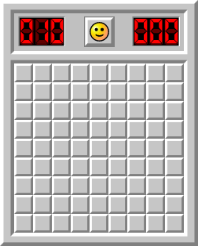
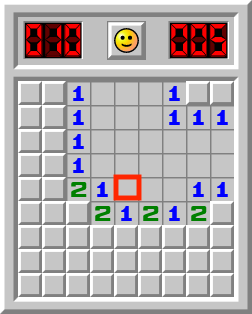
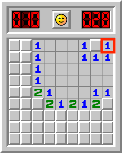

# Introduction

Minesweeper is a classical puzzle game that gained popularity in the 90s (much for being part of Microsoft Windows Entertainment Pack). The game was first released with Windows 3.11 (1992). It was a simple killing-time game at a time when smartphones didn't exist. 

The game displays a N×N tile board with a pre-defined number of (hidden) mines. When the player selects a tile, the game reveals how many mines are on adjacent tiles. When the player gets lucky by choosing a tile that has zero adjancent mines, the board (recursively) reveals surrounding cells until it finds information to reveal. Of course, the game ends when the user selects a  tile that has a hidden mine. The goal of the game is to be able to reveal all non-mined tiles. The pictures below illustrates how the game works. You can play it online at [https://minesweeper.online/](https://minesweeper.online/) but don't play for too long: go finish the assignment!

| | | |
|---|---|---|
||||
|Initial configuration|Tile revealing|Safe to click by elimination|
| | | |

Your goal in this assignment is to implement a simplified textual version of the minesweeper game. In the original version the player had the option to flag a tile that they think hides a mine. To simplify this assignment you will NOT be required to implement the mine-flagging option. Although you can get up to 10 bonus points if you decide to implement this feature. 

# The Minesweeper Class

The Minesweeper class controls the location of the mines using a **size**×**size** 2D array of Boolean. The number of **mines** and the parameter **size** are both determined upon instantion of this class. The game's board is controled using another 2D array (this one of characters). The following standard is to be used for the board: 

* '?' char denotes hidden tile;
* ' ' char denotes that the revealed tile has zero adjacent mines;
* 'd' char denotes that the revealed tile has "d" adjacent mines (d in [1,8]); 
* '*' char denotes that the revealed tile has a mine; and
* '+' char to denote a tile that has been flagged (if you are implementing this feature).

Parameter **size** and **mines** has to be at least **MIN_SIZE=6** and **MIN_MINES=1**, respectively. 

The **board** array should be initialized with '?' in the beginning of the game. The **map** array should be initialized by randomly setting **true** to **mines** locations (all other positions should be set to **false**). Hint: use helper method **hideMine** to initialize the **map** array. 

You are required to implement the **minesAround** helper method that returns the number of mines (immediately) around a given location. 

Public method **isMineDetonated** should return true if there is at least one tile in the board that reveals a mine. 

Public method **isGameOver** should return **true** if ALL non-mined tiles were revealed OR a mine was detonated; **false** otherwise. 

Finally, public method **reveal**, as the name suggests, attempts to reveal a tile given its location. In other words, the **board** should be updated based on parameters **x** and **y**. This method should return a Boolean to indicate whether the location was successfully revealed (non-mined location) or not (mined location).

Important: **reveal** should not have any output statement! It should only update the **board** array and return **true** or **false**.

You essentially have two options to implement **reveal**: recursively or using a loop with a stack (or queue) to hold temporary locations. There is a **Location** class that you can use if you choose to implement this method using a stack (a queue also works). Remember, when using a stack (or a queue) you are required to use the implementations discussed in this class. You are forbidden to use any of Java's standard data structures. I suggest using a stack. The provided code already gives you all the classes that you'll need: **Node**, **LinkedList**, and **Stack**. 

# The MinesweeperGame Class

You begin the game by asking for the player to choose the level that they want to play, which can be 1 (beginner), 2 (intermediate), or 3 (expert). Each level is associated with the following combination of tile size and number of mines: 

1. 10×10 with 10 mines
2. 15×15 with 25 mines
3. 20×20 with 50 mines

If the informed value is neither 1-3, assume beginner's level. 

Instantiate a version of the game (based on the selected level) and run a complete round. A round begins by telling the player how many mines to expect (hint: use **getMines** method). As long as the game is not over, display the board (hint: use Minesweeper's **toString**), then ask the user for a tile to reveal (x and y coordinates). Reveal the tile and finish the iteration. Remember: the loop runs until the game is over, which can happen because the location was mined (**reveal** returned **false**) or all non-mined tiles were revealed (**isGameOver** should return **true**). The final result of the game should be displayed (whether the player won or lost). 

# Submission

Submit your work on Canvas by uploading the zip of your src folder containing the following files: 

* Minesweeper.java
* MinesweeperGame.java

There is no need to add classes that I should have like Node, LinkedList, Stack, or Queue. 

I only accept zip format. I am expecting a single file named src.zip containing only the 2 files listed above, nothing else.

ALL source codes must be identified with your name(s) in the comments sections. You will loose 10 points if you don't write your name(s). 

You are authorized to work with a partner this time. Of course, when I say a partner I mean another student enrolled in CS-2 this semester. Only one of you need to submit on Canvas. However, make sure both of your names are listed in ALL source code. 

# Rubric

+80 Minesweeper.java
    +20 constructor
        +5 validates and initializes size
        +5 validates and initializes mines
        +5 instantiates and initalizes board
        +5 instantiates and initializes map
    +10 minesAround
    +5 isMineDetonated
    +10 isGameOver
    +35 reveal
        +10 reveals the given location as expected
        +5 correct return 
        +20 does it recursively (or using stack/queue) to reveal info about adjacent tiles
+20 MinesweeperGame.java
    +5 Minesweeper instantiation based on the selected level
    +10 main game loop with user interaction
    +5 shows end game result

# Bonus Points

You are eligible to +10 points if you implement the **flag** option in the following way: 

* players can flag a location by prefixing a coordinate with the letter '+' (for example, by entering "+8,10" the user indicates that they want to flag the tile at location x=8 and y=10)
* you should use char '+' to indicate that a location has been flagged
* it might be possible that the player flagged a non-mined location (in that case, non info about surrounding tiles should be given)
* the number of flags that the player can use should be set to the number of mines
